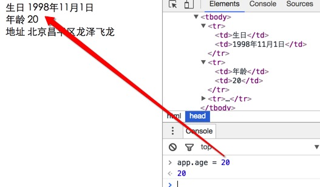

# Vue入门之概念及Helloworld

## Vue简介
`Vue`是一个前端的双向绑定类的框架，发音[读音 /vjuː/, 类似于 view]。新的Vue版本参考了React的部分设计，当然也有自己独特的地方，比如Vue的单文件组件开发方式都很有创新，另外Vue自身的一些绑定的语法、用法等都非常精炼，很容易上手，而且第三方的插件都非常丰富，社区非常活跃，最新的文档都有中文版本。而且Vue配合官方的和第三方的库可以实现单文件的组件化开发、SPA等现代化前端开发。  
详情请参考[Vue官网](https://cn.vuejs.org/)

## Vue的入门demo

`Vue` 可以直接把它当做一个js库使用，所以它可以很容易的接入到你的项目或者单个页面中。甚至你可以只使用它的双向绑定功能。所以它很容易上手。

比如：我们有一个需求，一个网页上一个Div标签，我们有一个json对象存储数据，把json对象上的数据放到Div上去。   

接下来是步骤：
```
第一步： 创建一个文件夹并创建一个html文件 比如：index.html.
当如你可以选择你自己的编辑器，我就用VSCode。

第二步：引入Vue库
<script src="https://unpkg.com/vue/dist/vue.js"></script>
当然了你可以直接下载Vue的js文件，推荐你直接用上面的cdn即可。

第三步：创建一个Div，给它一个id，比如：app

第四步：创建Vue的对象，并把数据绑定到上面创建好的div上去。
```
最终的代码如下：
```html
<!DOCTYPE html> <!--第一步：创建文件夹及html文件-->
<html lang="en">
<head>
  <meta charset="UTF-8">
  <title>Vue入门之Helloworld</title>
  <!--第二步：引入Vue库-->
  <script src="https://unpkg.com/vue/dist/vue.js"></script>
</head>
<body>
  <!--第三步:创建一个Div-->
  <div id="app">
    <!--Vue的模板的绑定数据的方法， 类似于很多其他前端的模板，可以用两对花括号进行绑定Vue中的数据对象的属性 -->
    {{ message }}
  </div>

  <!--第四步：创建Vue的对象，并把数据绑定到上面创建好的div上去。-->
  <script>
    var app = new Vue({         // 创建Vue对象。Vue的核心对象。
      el: '#app',               // el属性：把当前Vue对象挂载到 div标签上，#app是id选择器
      data: {                   // data: 是Vue对象中绑定的数据
        message: 'Hello Vue!'   // message 自定义的数据
      }
    });
  </script>
</body>
</html>

```
最终的结果就是：
```
Hello Vue!
```

## Vue的Helloworld总结
- Vue构造函数的：选项el属性，就是element缩写，当前Vue对象挂载到哪个标签上的语法，支持CSS选择器或者dom对象，一般用id选择器选择当前页面的标签。
- Vue的选项：data属性是自定义数据。这里我们只是演示了一个message属性，vue会把自定义的数据可以与html的模板数据进行绑定。
- Vue 数据绑定的方式就是用 `{{}}`，类似于handlebars.
- 上面这个demo就是演示了Vue的绑定数据的基本模型。注意点，标签先创建好了之后，再创建Vue对象，具体你应该懂吧。


----

# Vue入门之数据绑定

## 什么是双向绑定？
Vue框架很核心的功能就是双向的数据绑定。
双向是指：HTML标签数据 绑定到 Vue对象，另外反方向数据也是绑定的。通俗点说就是，Vue对象的改变会直接影响到HTML的标签的变化，而且标签的变化也会反过来影响Vue对象的属性的变化。   
这样以来，就彻底变革了之前Dom的开发方式，之前Dom驱动的开发方式尤其是以jQuery为主的开发时代，都是dom变化后，触发js事件，然后在事件中通过js代码取得标签的变化，再跟后台进行交互，然后根据后台返回的结果再更新HTML标签，异常的繁琐。有了Vue这种双向绑定，让开发人员只需要关心json数据的变化即可，Vue自动映射到HTML上，而且HTML的变化也会映射回js对象上，开发方式直接变革成了前端由数据驱动的
开发时代，远远抛弃了Dom开发主导的时代了。


## Vue绑定文本

数据绑定最常见的形式就是使用 “Mustache” 语法（双大括号）的文本插值，比如模板引擎：handlebars中就是用的`{{}}`.   
创建的Vue对象中的data属性就是用来绑定数据到HTML的。参考如下代码：
```html
<span>Message: {{ msg }}</span>
<script>
  var app = new Vue({         // 创建Vue对象。Vue的核心对象。
    el: '#app',               // el属性：把当前Vue对象挂载到 div标签上，#app是id选择器
    data: {                   // data: 是Vue对象中绑定的数据
      msg: 'Hello Vue!'   // message 自定义的数据
    }
  });
</script>
```

## 绑定数据中使用JavaScript表达式
对于所有的数据绑定， Vue.js 都提供了完全的 JavaScript 表达式支持。

```html
<span>Message: {{ msg + ' - ' + name }}</span>
<script>
  var app = new Vue({         // 创建Vue对象。Vue的核心对象。
    el: '#app',               // el属性：把当前Vue对象挂载到 div标签上，#app是id选择器
    data: {                   // data: 是Vue对象中绑定的数据
      msg: 'Hi',              // message 自定义的数据
      name: 'flydragon'       // name自定义的属性，vue可以多个自定义属性，属性类型也可是复杂类型
    }
  });
</script>
```
结果：
```
Hi - flydragon
```

当然Vue还可以支持表达中的任何计算、函数处理等。参考下面的综合点的案例。

```html
<!DOCTYPE html> 
<html lang="en">
<head>
  <meta charset="UTF-8">
  <title>Vue入门之数据绑定-表达式运算</title>
  <script src="https://unpkg.com/vue/dist/vue.js"></script>
</head>
<body>
  <div id="app">
    {{ msg + ' - ' + name }}
    <p>
      {{ isOk ? '123' : '456' }}
    </p>
    <p>我的年龄是： {{ age *2 }}</p>
  </div>

  <script>
  var app = new Vue({         // 创建Vue对象。Vue的核心对象。
    el: '#app',               // el属性：把当前Vue对象挂载到 div标签上，#app是id选择器
    data: {                   // data: 是Vue对象中绑定的数据
      msg: 'Hi',              // message 自定义的数据
      name: 'flydragon',
      isOk: true,
      age: 18
    }
  });
  </script>
</body>
</html>
```

## Vue属性绑定
Vue中不能直接使用`{{ expression }}` 语法进行绑定html的标签，而是用它特有的v-bind指令（就是一种写法，先按照格式走，具体指令是什么可以后续再了解）。   

绑定的语法结构：
```
<标签 v-bind:属性名="要绑定的Vue对象的data里的属性名"></标签>
例如:
<span v-bind:id="menuId">{{ menuName }}</span>
```
参考如下代码案例：
```html
<!DOCTYPE html> 
<html lang="en">
<head>
  <meta charset="UTF-8">
  <title>Vue入门之数据绑定--属性绑定</title>
  <script src="https://unpkg.com/vue/dist/vue.js"></script>
</head>
<body>
  <div id="app">
    <div v-bind:id="MenuContaineId">
      <a href="#" v-bind:class="MenuClass">首页</a>
      <a href="#" v-bind:class="MenuClass">产品</a>
      <a href="#" v-bind:class="MenuClass">服务</a>
      <a href="#" v-bind:class="MenuClass">关于</a>
    </div>
  </div>

  <script>
    var app = new Vue({         
      el: '#app',               
      data: {                   // data: 是Vue对象中绑定的数据
        MenuClass: 'top-menu',
        MenuContaineId: 'sitemenu'
      }
    });
  </script>
</body>
</html>
```

## 属性绑定简写
由于`v-bind` 使用非常频繁，所以Vue提供了简单的写法，可以去掉v-bind直接使用`:`即可。
```html
例如：
<div :id="MenuContaineId">
等价于
<div v-bind:id="MenuContaineId">
```

## 输出纯HTML
由于Vue对于输出绑定的内容做了提前encode，保障在绑定到页面上显示的时候不至于被xss攻击。但某些场景下，我们确保后台数据是安全的，那么我们就要在网页中显示原生的HTML标签。Vue提供了`v-html`指令。
```html
<div id="app">
  <div v-bind:id="MenuContaineId" v-html="MenuBody">
  </div>
</div>
<script>
  var app = new Vue({         
    el: '#app',               
    data: {                   // data: 是Vue对象中绑定的数据
      MenuContaineId: 'menu',
      MenuBody: '<p>这里是菜单的内容</p>'
    }
  });
</script>
```
结果：
```html
<div id="app">
  <div id="menu">
    <p>这里是菜单的内容</p>
  </div>
</div>
```

## 样式绑定
对于普通的属性的绑定，只能用上面的讲的绑定属性的方式。而Vue专门加强了class和style的属性的绑定。可以有复杂的对象绑定、数组绑定样式和类。

### 绑定样式对象
经常我们需要对样式进行切换，比如：div的显示和隐藏，某些标签active等。Vue提供的对象绑定样式的方式就很容做这些事情。
```html
代码：
<div v-bind:class="{ active: isActive }"></div>
解释：
当 isActive为 true时， div就会具有了active样式类，如果 isActive为false，那么div就去掉active样式类。
```

```html
<!DOCTYPE html> 
<html lang="en">
<head>
  <meta charset="UTF-8">
  <title>Vue入门之绑定样式类</title>
  <script src="https://unpkg.com/vue/dist/vue.js"></script>
  <style>
  .active {
    background-color: #ccc;
  }
  </style>
</head>
<body>
  <div id="app">
    <div v-bind:id="MenuContaineId" v-bind:class="{ active: isActive }">
      绑定颜色类
    </div>
  </div>
  <script>
    var app = new Vue({         
      el: '#app',               
      data: {                   // data: 是Vue对象中绑定的数据
        MenuContaineId: 'menu',
        isActive: true
      }
    });
  </script>
</body>
</html>
```

### 混合普通的HTML标签样式类及绑定样式对象

v-bind:class 指令可以与普通的 class 属性共存。
```html
<div id="app">
  <div class="static"
     v-bind:class="{ active: isActive, 'text-danger': hasError }">
  </div>
</div>
<script>
  var app = new Vue({         
    el: '#app',               
    data: {                   // data: 是Vue对象中绑定的数据
      isActive: true,
      hasError: false
    }
  });
</script>
```
结果：
```html
<div id="app">
  <div class="static active">
  </div>  
</div>
```

### 绑定data中的样式对象
直接在html属性中的双引号内写对象，还是很不爽，也没有智能提示，很容易写错。
Vue可以让我们直接把绑定的class字符串指向data的一个对象，这样就非常方便了，既可以有智能提示，又可以很复杂进行编辑，不用担心烦人的`""`了。

```html
<div id="app">
  <div class="static"
     v-bind:class="classObject">
  </div>
</div>
<script>
  var app = new Vue({         
    el: '#app',               
    data: {
      classObject: {
        active: true,
        'text-danger': false
      }
    }
  });
</script>
```
结果：
```html
<div id="app">
  <div class="static active">
  </div>
</div>

```

### 绑定样式数组
其实绑定数组，就是绑定样式对象的延续，看官网的例子代码吧。
```html
<div v-bind:class="[activeClass, errorClass]">

data: {
  activeClass: 'active',
  errorClass: 'text-danger'
}
```

当然还有很多其他很有趣的支持，就不赘述了。
```html
例如:
<div v-bind:class="[isActive ? activeClass : '', errorClass]">
<div v-bind:class="[{ active: isActive }, errorClass]">
```

### 内联样式绑定
内联样式的绑定，非常类似于样式类的操作。v-bind:style 的对象语法十分直观——看着非常像 CSS ，其实它是一个 JavaScript 对象。 CSS属性名可以用驼峰式（camelCase）或短横分隔命名（kebab-case）。

看个例子：
```html
<!DOCTYPE html> 
<html lang="en">
<head>
  <meta charset="UTF-8">
  <title>Vue入门之htmlraw</title>
  <script src="https://unpkg.com/vue/dist/vue.js"></script>
</head>
<body>
  <div id="app">
    <div v-bind:style="{fontSize: size + 'px', backgroundColor: bgcolor, width: width}">
      vue 入门系列教程
    </div>
  </div>
  <script>
    var app = new Vue({         
      el: '#app',               
      data: {                   
        size: 19,
        width: 200,
        bgcolor: 'red'
      }
    });
  </script>
</body>
</html>

```

自动添加前缀   
当 v-bind:style 使用需要特定前缀的 CSS 属性时，如 transform ，Vue.js 会自动侦测并添加相应的前缀。

## 计算属性
在做数据的绑定的时候,数据要进行处理之后才能展示到html页面上，虽然vue提供了非常好的表达式绑定的方法，但是只能应对低强度的需求。比如： 把一个日期按照规定格式进行输出，可能就需要我们对日期对象做一些格式化的出来，表达式可能就捉襟见肘了。

Vue对象提供的computed属性，可以让我们开发者在里面可以放置一些方法，协助我们绑定数据操作，这些方法可以跟data中的属性一样用，注意这些方法用的时候不要加`()`。
例子来了：
```html
<!DOCTYPE html> 
<html lang="en">
<head>
  <meta charset="UTF-8">
  <title>Vue入门之htmlraw</title>
  <script src="https://unpkg.com/vue/dist/vue.js"></script>
</head>
<body>
  <div id="app">
    <table>
      <tr>
        <!-- computed里面的函数可以直接当成data里面的属性用，非常方便，注意没有括号！！！-->
        <td>生日</td><td>{{ getBirthday }}</td>
      </tr>
      <tr>
        <td>年龄</td><td>{{ age }}</td>
      </tr>      
      <tr>
        <td>地址</td><td>{{ address }}</td>
      </tr>
    </table>
  </div>
  <script>
    var app = new Vue({         
      el: '#app',               
      data: {                   
        birthday: 914228510514,     // 这是一个日期对象的值：1998年11月1日
        age: 19,
        address: '北京昌平区龙泽飞龙'
      },
      computed: {
        // 把日期换成 常见规格格式的字符串。
        getBirthday: function () {
          var m = new Date(this.birthday);
          return m.getFullYear() + '年' + m.getMonth() +'月'+ m.getDay()+'日';
        }
      }
    });
  </script>
</body>
</html>
```

## 绑定的数据过滤器
过滤器本质就是数据在呈现之前先进行过滤和筛选。官网上写的不错，我就不再赘述，下面是官网的描述。

Vue.js 允许你自定义过滤器，被用作一些常见的文本格式化。过滤器应该被添加在 mustache 插值的尾部，由“管道符”指示：
```
{{ message | capitalize }}
<!-- in mustaches -->
{{ message | capitalize }}
<!-- in v-bind -->
<div v-bind:id="rawId | formatId"></div>
Vue 2.x 中，过滤器只能在 mustache 绑定和 v-bind 表达式（从 2.1.0 开始支持）中使用，因为过滤器设计目的就是用于文本转换。为了在其他指令中实现更复杂的数据变换，你应该使用计算属性。

过滤器函数总接受表达式的值作为第一个参数。
new Vue({
  // ...
  filters: {
    capitalize: function (value) {
      if (!value) return ''
      value = value.toString()
      return value.charAt(0).toUpperCase() + value.slice(1)
    }
  }
})
过滤器可以串联：
{{ message | filterA | filterB }}
过滤器是 JavaScript 函数，因此可以接受参数：
{{ message | filterA('arg1', arg2) }}
这里，字符串 'arg1' 将传给过滤器作为第二个参数， arg2 表达式的值将被求值然后传给过滤器作为第三个参数。
```

## 核心：自动响应对象的变化到HTML标签
上面的例子都是 数据对象是写死在创建的Vue对像上，那如果数据（data）发生改变时会怎样呢？
让我们用chrome把上面例子的页面打开，并打开发者工具控制台,输入：`app.age = 20` 会有什么情况发生呢？

---


在页面中添加一个按钮，动态的增加年龄：

```html
<!DOCTYPE html> 
<html lang="en">
<head>
  <meta charset="UTF-8">
  <title>Vue入门之htmlraw</title>
  <script src="https://unpkg.com/vue/dist/vue.js"></script>
</head>
<body>
  <div id="app">
    <table>
      <tr>
        <!-- computed里面的函数可以直接当成data里面的属性用，非常方便，注意没有括号！！！-->
        <td>生日</td><td>{{ getBirthday }}</td>
      </tr>
      <tr>
        <td>年龄</td><td>{{ age }}</td>
      </tr>      
      <tr>
        <td>地址</td><td>{{ address }}</td>
      </tr>
    </table>
  </div>

  <!-- 添加下面这行代码，动态增加 年龄，页面会有怎样的变化呢？？ -->
  <button type="button" onclick="app.age+=1;" >加加</button>
  <script>
    var app = new Vue({         
      el: '#app',               
      data: {                   
        birthday: 914228510514,     // 这是一个日期对象的值：1998年11月1日
        age: 19,
        address: '北京昌平区龙泽飞龙'
      },
      computed: {
        // 把日期换成 常见规格格式的字符串。
        getBirthday: function () {
          var m = new Date(this.birthday);
          return m.getFullYear() + '年' + m.getMonth() +'月'+ m.getDay()+'日';
        }
      }
    });
  </script>
</body>
</html>

```

## 双向数据绑定

上面的例子我们大多讲的是单向的 js对象向 HTML数据进行绑定，那HTML怎样向js进行反馈数据呢？
HTML中只有表达能接受用户的输入，最简单的演示双向绑定的就是文本框了。

Vue提供了一个新的指令：v-model进行双向数据的绑定，注意不是v-bind。
```html
<!DOCTYPE html> 
<html lang="en">
<head>
  <meta charset="UTF-8">
  <title>Vue入门之htmlraw</title>
  <script src="https://unpkg.com/vue/dist/vue.js"></script>
</head>
<body>
  <div id="app">
    <!-- v-model可以直接指向data中的属性，双向绑定就建立了 -->
    <input type="text" name="txt" v-model="msg">
    <p>您输入的信息是：{{ msg }}</p>
  </div>
  <script>
    var app = new Vue({         
      el: '#app',               
      data: {                   
        msg: '双向数据绑定的例子'
      }
    });
  </script>
</body>
</html>
```

最终的结果就是：你改变input文本框的内容的时候，p标签中的内容会跟着进行改变，哇是不是很神奇呢...

关于其他表单的绑定的语法我就不赘述了，还是参考官网吧，我这里大部分例子也是来自[官网](https://cn.vuejs.org/v2/guide/forms.html#基础用法)。

## 数据绑定总结

vue提供了大量的绑定的语法和方法，非常方便我们进行数据的绑定，尤其它是双向的数据绑定，极大的减少了我们dom操作的麻烦程度。可能你越来越喜欢它了吧...

------

# Vue列表渲染及条件渲染实战

## 条件渲染

有时候我们要根据数据的情况，决定标签是否进行显示或者有其他动作。最常见的就是，表格渲染的时候，如果表格没有数据，就显示无数据。如果有数据就显示表格数据。
Vue帮我们提供了一个`v-if`的指令，帮助我们完成判断的模板处理。

```html
<div id="app">
  <h1 v-if="ok">Yes</h1>
  <h1 v-else>No</h1>  
</div>
<!-- 当ok为true的时候，输出： Yes， 否则输出： No -->

<script>
  var app = new Vue({         
    el: '#app',               
    data: {    
      ok: true      // true,返回：Yes，   false=> No               
    }
  });
</script>
```

`v-if`指令可以根据数据绑定的情况进行插入标签或者移除标签。
当然，如果熟悉js的都清楚，有if，肯定会有else。 Vue提供的是 `v-else`指令。

## 列表渲染

### 基本v-for循环渲染标签
模板引擎都会提供循环的支持。Vue也不例外，Vue是提供了一个`v-for`指令。基本的用法类似于foreach的用法。还是看例子最直接，上代码：

```html
<div id="app">
  <table>
    <thead>
      <tr>
        <th>姓名</th>
        <th>年龄</th>
        <th>地址</th>
      </tr>
    </thead>
    <tbody> 
      <!-- 每次for循环，都会创建一个tr标签。item是遍历的元素。 -->
      <tr v-for="item in UserList" >
        <td>{{ item.name }}</td>
        <td>{{ item.age }}</td>
        <td>{{ item.address }}</td>
      </tr>
    </tbody>
  </table>
</div>
<script>
  var app = new Vue({         
    el: '#app',               
    data: {                   
     UserList: [
      {'name': 'malun', 'age': 18, 'address': '北京黑地下室'},
      {'name': 'flydragon', 'age': 22, 'address': '厦门的很多热的地方'},
      {'name': 'temp', 'age': 25, 'address': '东北松花江上'}
     ]
    }
  });
</script>
```

### Template循环渲染多标签
上面的例子，我们演示的是 每次循环输出一个tr标签。如果我们希望每次循环生成两个tr标签呢？如果还有生成其他的标签呢？

Vue给我们提供了template标签，供我们用于v-for循环中进行处理。

上代码喽：
```html
<ul>
  <!-- 通过template标签，可以一次循环，输出两个li标签 -->
  <template v-for="item in items">
    <li>{{ item.msg }}</li>
    <li class="divider"></li>
  </template>
</ul>
```

### 关于v-for对应的数组的更新
由于Vue的机制就是检测数据的变化，自动跟新HTML。数组的变化，Vue之检测部分函数，检测的函数执行时才会触发视图更新。这些方法如下：
- push()
- pop()
- shift()
- unshift()
- splice()
- sort()
- reverse()

## 表格显示的综合案例
下面是一个综合的案例，每秒钟往表格中添加一条数据。
本案例综合使用了v-if 和 v-for循环综合案例。
```html
<!DOCTYPE html> 
<html lang="en">
<head>
  <meta charset="UTF-8">
  <title>Vue入门之动态显示表格</title>
  <script src="https://unpkg.com/vue/dist/vue.js"></script>
</head>
<body>
  <div id="app">
    <table>
      <thead>
        <tr>
          <th>姓名</th>
          <th>年龄</th>
          <th>地址</th>
        </tr>
      </thead>
      <!-- 如果列表有数据，直接输出表格数据，没有数据提示用户没有数据 -->
      <tbody v-if="UserList.length > 0"> 
        <tr v-for="item in UserList" >
          <td>{{ item.name }}</td>
          <td>{{ item.age }}</td>
          <td>{{ item.address }}</td>
        </tr>
      </tbody>
      <tbody v-else>
        <tr><td colspan="3">没有数据奥！</td></tr>
      </tbody>
    </table>
  </div>
  <script>
    var app = new Vue({         
      el: '#app',               
      data: {                   
       UserList: []
      }
    });

    // 每秒钟插入一条数据。
    setInterval(function () {
      app.UserList.push({'name': 'malun', 'age': 18, 'address': '北京黑地下室'});
    }, 1000);
  </script>
</body>
</html>
```

## 总结列表和条件绑定
列表的使用其实本质还是js的衍生使用，对于有js开发基础的没有什么难度。关键是多写几个案例就会详细通了。

-----------

# Vue事件处理

## 监听事件的Vue处理
Vue提供了协助我们为标签绑定时间的方法，当然我们可以直接用dom原生的方式去绑定事件。Vue提供的指令进行绑定也是非常方便，而且能让ViewModel更简洁，逻辑更彻底。所以还是推荐大家使用的。

Vue提供了`v-on`指令帮助我们进行事件的绑定。
基本的内联事件处理方法[官方demo]：   

```html
<div id="example-1">
  <!-- 为按钮绑定点击事件，执行counter += 1的任务。 -->
  <button v-on:click="counter += 1">增加 1</button>
  <p>这个按钮被点击了 {{ counter }} 次。</p>
</div>
<script>
var example1 = new Vue({
  el: '#example-1',
  data: {
    counter: 0
  }
})
</script>
```

## 事件处理方法集成到Vue对象
内联的方式绑定的事件，只能处理简单的事件的处理逻辑。复杂的情况还是封装到js中最方便，也不容易出错。
Vue对象中可以添加methods属性，开发者可以把事件处理函数的逻辑放到methods中。

```html
<!DOCTYPE html> 
<html lang="en">
<head>
  <meta charset="UTF-8">
  <title>Vue入门之动态显示表格</title>
  <script src="https://unpkg.com/vue/dist/vue.js"></script>
</head>
<body>
  <div id="app">
    <p>{{ number }}</p>
    <input type="button" name="btnGetNumber" value="增加[绑定事件处理器]" v-on:click="getNumber">
    <input type="button" name="btnGetNumber" value="增加[内联方法调用]" v-on:click="getNumber()">
  </div>
  <script>
    var app = new Vue({         
      el: '#app',               
      data: {                   
        number: 1
      },
      methods: {
        // 事件响应方法的逻辑代码
        getNumber: function (e) {
          this.number += 1;   // 不管是内联方法调用，还是绑定事件处理器两种方式执行事件响应方法的时候 this都是指向 app
        }
      }
    });
  </script>
</body>
</html>
```

## 事件修饰符
官网上写的非常好，这块就直接用管网的吧。在事件处理程序中调用 event.preventDefault() 或 event.stopPropagation() 是非常常见的需求。尽管我们可以在 methods 中轻松实现这点，但更好的方式是：methods 只有纯粹的数据逻辑，而不是去处理 DOM 事件细节。
为了解决这个问题， Vue.js 为 v-on 提供了 事件修饰符。通过由点(.)表示的指令后缀来调用修饰符。
- .stop
- .prevent
- .capture
- .self
- .once
```html
<!-- 阻止单击事件冒泡 -->
<a v-on:click.stop="doThis"></a>
<!-- 提交事件不再重载页面 -->
<form v-on:submit.prevent="onSubmit"></form>
<!-- 修饰符可以串联  -->
<a v-on:click.stop.prevent="doThat"></a>
<!-- 只有修饰符 -->
<form v-on:submit.prevent></form>
<!-- 添加事件侦听器时使用事件捕获模式 -->
<div v-on:click.capture="doThis">...</div>
<!-- 只当事件在该元素本身（而不是子元素）触发时触发回调 -->
<div v-on:click.self="doThat">...</div>
<!-- the click event will be triggered at most once -->
<a v-on:click.once="doThis"></a>
```

## 按键修饰符
在监听键盘事件时，我们经常需要监测常见的键值。 Vue 允许为 v-on 在监听键盘事件时添加按键修饰符：
```html
<!-- 只有在 keyCode 是 13 时调用 vm.submit() -->
<input v-on:keyup.13="submit">
记住所有的 keyCode 比较困难，所以 Vue 为最常用的按键提供了别名：
<!-- 同上 -->
<input v-on:keyup.enter="submit">
<!-- 缩写语法 -->
<input @keyup.enter="submit">
```

全部的按键别名：

- .enter
- .tab
- .delete (捕获 “删除” 和 “退格” 键)
- .esc
- .space
- .up
- .down
- .left
- .right
- .ctrl
- .alt
- .shift
- .meta

## 事件绑定的简写
Vue中属性的绑定的简写直接是`:` === 'v-bind:'   
而事件的缩写是直接变成`@`.  也就是说：  `v-on:` === `@`
看下面的例子：
```html
<!-- 完整语法 -->
<a v-on:click="doSomething"></a>
<!-- 缩写 -->
<a @click="doSomething"></a>
```

## 事件绑定总结

Vue为了方便大家进行开发，提供了事件的相关的封装，可以让我们方便我们用Vue对事件进行开发，尤其是v-on指令的非常方便的跟Vue对象中methods进行配合进行复杂的事件处理，非常方便。另外事件的事件修饰符和按键修饰符也可以让Vue事件这块锦上添花。

---------

# Vue实例详解与生命周期

Vue的实例是Vue框架的入口，其实也就是前端的ViewModel，它包含了页面中的业务逻辑处理、数据模型等，当然它也有自己的一系列的生命周期的事件钩子，辅助我们进行对整个Vue实例生成、编译、挂着、销毁等过程进行js控制。

## Vue实例初始化的选项配置对象详解

前面我们已经用了很多次 `new Vue({...})`的代码，而且Vue初始化的选项都已经用了`data`、`methods`、`el`、`computedd`等,估计您看到这里时，应该已经都明白了他们的作用，我们就详细讲解一下他们的使用情况。更详细的请参考[官网内容](https://cn.vuejs.org/v2/api/#data)

### Vue实例的的data对象

- 介绍

Vue的实例的数据对象data 我们已经用了很多了，数据绑定离不开data里面的数据。也是Vue的核心属性。
它是Vue绑定数据到HTML标签的数据源泉，另外Vue框架会自动监视data里面的数据变化，自动更新数据到HTML标签上去。本质原理是：Vue会自动将data里面的数据进行递归抓换成getter和setter，然后就可以自动更新HTML标签了，当然用getter和setter所以老的浏览器Vue支持的不够好。

- data对象的类型：

  + 类型是Object或者Function。
  + 如果是组件对象中，data必须是Function类型。【后面学了组件后就明白了，暂时对组件先放放。】

- 实例：

```js
// 创建普通的Vue实例
var vm = new Vue({
  data: data
})

// 组件定义【后面会详细讲的】
// Vue.extend() 中 data 必须是函数
var Component = Vue.extend({
  data: function () {   //这里必须是函数！！！！
    return { a: 1 }
  }
})
```

### Vue实例的computed

- 介绍

Vue的计算属性（computed)的属性会自动混入Vue的实例中。所有 getter 和 setter 的 this 上下文自动地绑定为 Vue 实例。这就很强大了，再计算属性中定义的函数里面可以直接使用指向了vue实例的this，异常方便的啊。

- 类型

`{ 键：函数}`
`{ [key: string]: Function | { get: Function, set: Function } }`
当然，可以省略setter,如果省略了setter，那么值就可以是普通函数，但是必须有返回值。

- 官方的实例
```html
var vm = new Vue({
  data: { a: 1 },
  computed: {
    // 仅读取，值只须为函数
    aDouble: function () {
      return this.a * 2
    },
    // 读取和设置
    aPlus: {
      get: function () {
        return this.a + 1
      },
      set: function (v) {
        this.a = v - 1
      }
    }
  }
})
vm.aPlus   // -> 2
vm.aPlus = 3
vm.a       // -> 2
vm.aDouble // -> 4
```

### methods

- 类型: { [key: string]: Function }

- 详细:

methods 将被混入到 Vue 实例中。可以直接通过 VM 实例访问这些方法，或者在指令表达式中使用。方法中的 this 自动绑定为 Vue 实例。

注意，不应该使用箭头函数来定义 method 函数 (例如 plus: () => this.a++)。理由是箭头函数绑定了父级作用域的上下文，所以 this 将不会按照期望指向 Vue 实例，this.a 将是 undefined。

- 示例:

```js
var vm = new Vue({
  data: { a: 1 },
  methods: {
    plus: function () {
      this.a++
    }
  }
})
vm.plus()
vm.a // 2
```

### watch
- 类型

` { [key: string]: string | Function | Object }`

- 详细:

一个对象，键是需要观察的表达式，值是对应回调函数。值也可以是方法名，或者包含选项的对象。Vue 实例将会在实例化时调用 $watch()，遍历 watch 对象的每一个属性。

- 示例:

```js
var vm = new Vue({
  data: {
    a: 1,
    b: 2,
    c: 3
  },
  watch: {
    // 监控a变量变化的时候，自动执行此函数
    a: function (val, oldVal) {
      console.log('new: %s, old: %s', val, oldVal)
    },
    // 深度 watcher
    c: {
      handler: function (val, oldVal) { /* ... */ },
      deep: true
    }
  }
})
vm.a = 2 // -> new: 2, old: 1
//注意，不应该使用箭头函数来定义 watcher 函数 (例如 searchQuery: newValue => this.updateAutocomplete(newValue))。理由是箭头函数绑定了父级作用域的上下文，所以 this 将不会按照期望指向 Vue 实例，this.updateAutocomplete 将是 undefined。
```

参考综合案例：
```html
<!DOCTYPE html> 
<html lang="en">
<head>
  <meta charset="UTF-8">
  <title>Vue入门之数据监控</title>
  <script src="https://unpkg.com/vue/dist/vue.js"></script>
</head>
<body>
  <div id="app">
    <p>{{ number }}</p>
    <input type="button" name="btnGetNumber" value="增加" v-on:click="getNumber()">
  </div>
  <script>
    var app = new Vue({         
      el: '#app',               
      data: {                   
        number: 1
      },
      methods: {
        // 事件响应方法的逻辑代码
        getNumber: function (e) {
          this.number += 1;   // 不管是内联方法调用，还是绑定事件处理器两种方式执行事件响应方法的时候 this都是指向 app
        }
      },
      watch: {
        // 监控number的变化，并自动执行下面的函数
        number: function (val, oldVal) {
          console.log('val:' + val + ' - oldVal: ' + oldVal);
        }
      }
    });
  </script>
</body>
</html>
```

### 设置el的详解
- 类型

` string | HTMLElement`

限制： 只在由 new 创建的实例中遵守。

- 详细：

提供一个在页面上已存在的 DOM 元素作为 Vue 实例的挂载目标,也就是说Vue绑定数据到哪里去找。可以是`CSS 选择器`，也可以是一个 `HTMLElement实例`。

在实例挂载之后(生命周期的内容后面会详细讲的奥)， 元素可以用 vm.$el 访问。

如果这个选项在实例化时有作用，实例将立即进入编译过程，否则，需要显式调用 vm.$mount() 手动开启编译。

```js
// 几乎所有例子都用到这个，所以就不再赘述
var app = new Vue({         
  el: '#app',
  ...
});          
```

## Vue实例的生命周期

Vue实例有一个完整的生命周期，也就是从开始创建、初始化数据、编译模板、挂载Dom、渲染→更新→渲染、卸载等一系列过程，我们称这是Vue的生命周期。通俗说就是Vue实例从创建到销毁的过程，就是生命周期。

在Vue的整个生命周期中，它提供了一系列的事件，可以让我们注册js方法，可以让我们达到控制整个过程的目的地，哇赛，如果你搞过Asp.Net WebForm的话，你会发现整个就是WebForm的翻版嘛哈哈。值得注意的是，在这些事件响应方法中的this直接指向的是vue的实例。

首先看看下面官网的一张生命周期的图，我做一下标注，看看整体的流程，后面我们上代码做一下效果。


Vue提供的可以注册的钩子都在上图片的红色框标注。
他们是：

- `beforeCreate`

在实例初始化之后，数据观测(data observer) 和 event/watcher 事件配置之前被调用。

- `created`

实例已经创建完成之后被调用。在这一步，实例已完成以下的配置：数据观测(data observer)，属性和方法的运算， watch/event 事件回调。然而，挂载阶段还没开始，$el 属性目前不可见。

- `beforeMount`

在挂载开始之前被调用：相关的 render 函数首次被调用。

- `mounted`

el 被新创建的 vm.$el 替换，并挂载到实例上去之后调用该钩子。如果 root 实例挂载了一个文档内元素，当 mounted 被调用时 vm.$el 也在文档内。

- `beforeUpdate`

数据更新时调用，发生在虚拟 DOM 重新渲染和打补丁之前。
你可以在这个钩子中进一步地更改状态，这不会触发附加的重渲染过程。

- `updated`

由于数据更改导致的虚拟 DOM 重新渲染和打补丁，在这之后会调用该钩子。

当这个钩子被调用时，组件 DOM 已经更新，所以你现在可以执行依赖于 DOM 的操作。然而在大多数情况下，你应该避免在此期间更改状态，因为这可能会导致更新无限循环。

该钩子在服务器端渲染期间不被调用。

- `beforeDestroy`

实例销毁之前调用。在这一步，实例仍然完全可用。

- ` destroyed`

Vue 实例销毁后调用。调用后，Vue 实例指示的所有东西都会解绑定，所有的事件监听器会被移除，所有的子实例也会被销毁。
该钩子在服务器端渲染期间不被调用。

接下来我们做一个例子，看一下Vue中所有的生命周期怎么用的。

```html
<!DOCTYPE html> 
<html lang="en">
<head>
  <meta charset="UTF-8">
  <title>Vue入门之生命周期</title>
  <script src="https://unpkg.com/vue/dist/vue.js"></script>
</head>
<body>
  <div id="app">
    <p>{{ number }}</p>
    <input type="text" name="btnSetNumber" v-model="number">
  </div>
  <script>
    var app = new Vue({         
      el: '#app',               
      data: {                   
        number: 1
      },
      beforeCreate: function () {
        console.log('beforeCreate 钩子执行...');
        console.log(this.number)
      },
      cteated: function () {
        console.log('cteated 钩子执行...');
        console.log(this.number)
      },
      beforeMount: function () {
        console.log('beforeMount 钩子执行...');
        console.log(this.number)
      },
      mounted: function () {
        console.log('mounted 钩子执行...');
        console.log(this.number)
      },
      beforeUpdate: function () {
        console.log('beforeUpdate 钩子执行...');
        console.log(this.number)
      },
      updated: function () {
        console.log('updated 钩子执行...');
        console.log(this.number)
      },
      beforeDestroy: function () {
        console.log('beforeDestroy 钩子执行...');
        console.log(this.number)
      },
      destroyed: function () {
        console.log('destroyed 钩子执行...');
        console.log(this.number)
      },
    });
  </script>
</body>
</html>
```

再看一个综合的实战的例子，可能涉及到ajax和组件，不过先看一下vue的生命周期的例子的用法：

```js
import Axios from 'axios'       // 这是一个轻量级的ajax库，import是es6模块导入的语法。
export default {                // 这是一个vue的模块，后面讲奥。
  name: 'app',
  components: {
  },
  data: function () {
    return {
      list: []
    }
  },
  mounted: function () {          // 挂在完成后的生命周期钩子注册。
    this.$nextTick(function () {  // 等待下一次更新完成后执行业务处理代码。
      Axios.get('/api/menulist', {// 将回调延迟到下次 DOM 更新循环之后执行。在修改数据之后立即使用它，然后等待 DOM 更新
        params: {
        }
      }).then(function (res) {
        this.list = res.data
      }.bind(this))
    })
  }
}
```
## Vue实例的全局配置
这一块都是一些小的知识点，我就不赘述了，直接copy [官网](https://cn.vuejs.org/v2/api/#silent) 
Vue.config 是一个对象，包含 Vue 的全局配置。可以在启动应用之前修改下列属性：
- silent

  - 类型： boolean

  - 默认值： false

  - 用法：
  ```js
  Vue.config.silent = true
  //取消 Vue 所有的日志与警告。
  ```
- optionMergeStrategies

  - 类型： { [key: string]: Function }

  - 默认值： {}

  - 用法：
  ```js 
  Vue.config.optionMergeStrategies._my_option = function (parent, child, vm) {
    return child + 1
  }
  const Profile = Vue.extend({
    _my_option: 1
  })
  // Profile.options._my_option = 2
  //自定义合并策略的选项。
  //合并策略选项分别接受第一个参数作为父实例，第二个参数为子实例，Vue实例上下文被作为第三个参数传入。
  ```

- devtools

  - 类型： boolean

  - 默认值： true (生产版为 false)

  - 用法：
  ```js
  // 务必在加载 Vue 之后，立即同步设置以下内容
  Vue.config.devtools = true
  //配置是否允许 vue-devtools 检查代码。开发版本默认为 true，生产版本默认为 false。生产版本设为 true 可以启用检查。
  ```

- errorHandler

  - 类型： Function

  - 默认值： 默认抛出错误

  - 用法：
  ```js
  Vue.config.errorHandler = function (err, vm) {
    // handle error
  }
  //指定组件的渲染和观察期间未捕获错误的处理函数。这个处理函数被调用时，可获取错误信息和 Vue 实例。
  //Sentry, an error tracking service, provides official integration using this option.
```
- ignoredElements

  - 类型: Array<string>

  - 默认值: []

  - 用法:
  ```js
  Vue.config.ignoredElements = [
    'my-custom-web-component', 'another-web-component'
  ]
  须使 Vue 忽略在 Vue 之外的自定义元素 (e.g., 使用了 Web Components APIs)。否则，它会假设你忘记注册全局组件或者拼错了组件名称，从而抛出一个关于 Unknown custom element 的警告。
  ```

- keyCodes

  - 类型： { [key: string]: number | Array<number> }

  - 默认值： {}

  - 用法：
  ```js
  Vue.config.keyCodes = {
    v: 86,
    f1: 112,
    mediaPlayPause: 179,
    up: [38, 87]
  }api
  //给 v-on 自定义键位别名。
  ```

## Vue的全局API

Vue的全局API提供大量的功能，我这里就给大家罗列几个常用的结果，其他的还是参考[官网](https://cn.vuejs.org/v2/api/#全局-API).

### Vue.nextTick

`语法： Vue.nextTick( [callback, context] )`

```
参数：    
{Function} [callback]
{Object} [context]
```

用法：
在下次 DOM 更新循环结束之后执行延迟回调。在修改数据之后立即使用这个方法，获取更新后的 DOM。

```js
// 修改数据
vm.msg = 'Hello'
// DOM 还没有更新
Vue.nextTick(function () {
  // DOM 更新了
})
```
### Vue.set

`语法： Vue.set( object, key, value )`

```
参数：
{Object} object
{string} key
{any} value
返回值： 设置的值.
```
用法：    
设置对象的属性。如果对象是响应式的，确保属性被创建后也是响应式的，同时触发视图更新。这个方法主要用于避开 Vue 不能检测属性被添加的限制。
注意对象不能是 Vue 实例，或者 Vue 实例的根数据对象。

### Vue.compile

- 语法：    

`Vue.compile( template )`

- 参数：

`{string} template`

- 用法：

```js
//在render函数中编译模板字符串。只在独立构建时有效
var res = Vue.compile('<div><span>{{ msg }}</span></div>')
new Vue({
  data: {
    msg: 'hello'
  },
  render: res.render,
  staticRenderFns: res.staticRenderFns
})
```
        
### 全局API总结

其实还有几个其他的全局API，不打算在这里讲了，比如扩展组件Vue.extend 的用法、Vue.use加载插件、Vue.filter加载过滤器、Vue.directive自定义指令等
后面再讲其他Vue的知识点的时候，再加上这些，全局API其实就是Vue类型的静态方法，全局范围内都可以使用的，某些实例的方法本质也是调用了这些全局的，后面用到时候再说。

## Vue实例与生命周期总结
Vue的实例封装的还是挺有艺术性的，很符合开发者的思维规范，它的生命周期也非常清晰，使用起来也非常方便。Vue确实一个好框架。

------------------

# Vue入门之组件化开发

组件其实就是一个拥有样式、动画、js逻辑、HTML结构的综合块。前端组件化确实让大的前端团队更高效的开发前端项目。而作为前端比较流行的框架之一，Vue的组件和也做的非常彻底，而且有自己的特色。尤其是她单文件组件开发的方式更是非常方便，而且第三方工具支持也非常丰富，社区也非常活跃，第三方组件也呈井喷之势。当然学习和使用Vue的组件也是我们的最重要的目标。

## 全局扩展方法`Vue.extend`
Vue提供了一个全局的API，`Vue.extend`可以帮助我们对Vue实例进行扩展，扩展完了之后，就可以用此扩展对象创建新的Vue实例了。
类似于继承的方式。
```
语法：Vue.extend( options )

参数：

{Object} options
用法：

使用基础 Vue 构造器，创建一个“子类”。参数是一个包含组件选项的对象[后面会细讲]。

data 选项是特例，需要注意 - 在 Vue.extend() 中它必须是函数
```
下面是一个官网demo：
```html
<div id="mount-point"></div>
<script>
// 创建构造器
var Profile = Vue.extend({
  // 新的对象的模板，所有子实例都会拥有此模板
  template: '<p>{{firstName}} {{lastName}} aka {{alias}}</p>',
  data: function () {   // 创建的Vue实例时，data可以是Object 也可以是Function，但是在扩展
    return {            // 的时候，data必须是一个函数，而且要返回值奥。
      firstName: 'Walter',
      lastName: 'White',
      alias: 'Heisenberg'
    }
  }
})
</script>


// 创建 Profile 实例，并挂载到一个元素上。
new Profile().$mount('#mount-point')
// .$mount() 方法跟设置 el属性效果是一致的。

结果如下：

<p>Walter White aka Heisenberg</p>
```

综合案例代码：
```html
<!DOCTYPE html> 
<html lang="en">
<head>
  <meta charset="UTF-8">
  <title>Vue入门之extend全局方法</title>
  <script src="https://unpkg.com/vue/dist/vue.js"></script>
</head>
<body>
  <div id="app">
  </div>
  <script>
    var myVue = Vue.extend({
      template: '<div>{{ name }} - {{ age }} - {{ mail }}</div>',
      data: function () {
        return {
          name: 'malun',
          age: '19',
          mail: 'flydragonml@gmail.com'
        };
      }
    });
    var app = new myVue({         
      el: '#app'             
    });
  </script>
</body>
</html>
```

## 创建组件和注册组件

当然上面的方式只是能让我们继承Vue实例做一些扩展的动作。看Vue中如何创建一个组件并注册使用。

Vue提供了一个全局注册组件的方法：Vue.component。

```
语法： Vue.component( id, [definition] )

参数：
  {string} id    组件的名字，可以当HTML标签用，注意组件的名字都是小写，而且最好有横线和字母组合。
  {Function | Object} [definition]   组件的设置
  
用法：
注册或获取全局组件。注册还会自动使用给定的id设置组件的名称

// 注册组件，传入一个扩展过的构造器
Vue.component('my-component', Vue.extend({ /* ... */ }))
// 注册组件，传入一个选项对象（自动调用 Vue.extend）
Vue.component('my-component', { /* ... */ })
// 获取注册的组件（始终返回构造器）
var MyComponent = Vue.component('my-component')
``` 

简单demo：

```html
<div id="example">
  <!--组件直接跟普通的标签一样的使用。-->
  <my-component></my-component>
</div>
```
```js
// 注册一个组件
Vue.component('my-component', {
  // 模板选项设置当前组件，最终输出的html模板。注意：有且只有一个根元素。
  template: '<div>A custom component!</div>'
})
// 创建根实例
new Vue({
  el: '#example'
})
```

那么我们注册一个组件自动帮我生成 label和radiobutton组合。
```html
<!DOCTYPE html> 
<html lang="en">
<head>
  <meta charset="UTF-8">
  <title>Vue入门之extend全局方法</title>
  <script src="https://unpkg.com/vue/dist/vue.js"></script>
</head>
<body>
  <div id="app">
    <!--组件名直接可以当标签使用。-->
    <radio-tag rid="rBas" txt="篮球" val="1"></radio-tag>

    <!--组件的属性也可以使用Vue的绑定的语法，下面是动态绑定数据给子组件-->
    <radio-tag :rid="demoId" :txt="demoText" :val="demoVal"></radio-tag>
  </div>
  <script>
    // 定义组件模板，模板必须有且只有一个根元素。
    var temp = '<div><label v-bind:for="rid">{{ txt }}</label><input :id="rid" type="radio" v-bind:value="val"></div>';
    // 注册一个全局的组件
    Vue.component('radio-tag', {       // 组件的名字不能有大写字母，跟React的曲别啊。另外组件名最好是小写字母加横线组合。
      template: temp,   
      props: ['rid', 'txt', 'val'],   // 设置组件的属性有哪些，定义标签的属性一致。
      data: function () {             // 注意属性名都得是小写，不然会不认的。
        return {                      // 在组件的定义中data必须是函数，而且必须有返回值。
          age: 19,                    // 此地方的 age 和 emial都是演示，并么有有到。
          email: 'flydragonml@gmail.com'
        }
      } 
    });                                

    // 初始化一个Vue实例
    var app = new Vue({         
      el: '#app',               
      data: {                   
        demoId: 'ft',
        demoText: '足球',
        demoVal: 2
      }
    });
  </script>
</body>
</html>
```
注意结果点
- 组件的名字都必须是小写【[其实是非必须，但是为了不麻烦就强制吧](https://cn.vuejs.org/v2/guide/components.html#组件命名约定)】！！！而且建议是小写字母和横线的组合比如： my-radiobtn
- 注册组件的时候，可以传入一个选项对象进行配置。其中`props`是设置当前组件的属性，属性也都必须小写。属性是连接父容器和子组件的桥梁。
- 注意：属性名和组件的名字都要小写啊，不然vue不会认的。
- 编写组件代码最好配合Vue的chrome插件：[vue-devtool](https://github.com/vuejs/vue-devtools)
- 组件可以返还自己的数据，但是必须是函数。data必须是Function

## 局部注册组件
全局注册组件就是使用全局API `Vue.componet(id, {....})`就行了，当然我们有时候需要注册一个局部模块的自己用的组件。那么就可以用下面的方式了。

```js
var Child = {
  template: '<div>A custom component!</div>'
}
new Vue({
  // ...
  components: {
    // <my-component> 将只在父模板可用
    'my-component': Child
  }
})
```

## 组件的slot
使用组件的时候，经常需要在父组件中为子组件中插入一些标签等。当然其实可以通过属性等操作，但是比较麻烦，直接写标签还是方便很多。
那么Vue提供了slot协助子组件对父容器写入的标签进行管理。

当父容器写了额外的内容时， 如果子组件恰好有一个slot标签，那边子容器的slot标签会被父容器写入的内容替换掉。

比如下面的例子：
```html
<!DOCTYPE html> 
<<!DOCTYPE html> 
<html lang="en">
<head>
  <meta charset="UTF-8">
  <title>Vue入门之extend全局方法</title>
  <script src="https://unpkg.com/vue/dist/vue.js"></script>
</head>
<body>
  <div id="app">
    <!--父容器输入标签-->
    <my-slot>
      <h3>这里是父容器写入的</h3>
    </my-slot>

    <!--父容器绑定数据到子容器的slot,这里的作用域是父容器的啊。-->
    <my-slot>{{ email }}</my-slot>

    <!--父容器什么都不传内容-->
    <my-slot></my-slot>
  </div>
  <script>
    // 反引号：可以定义多行字符串。
    var temp = `
      <div>
        <h1>这里是子组件</h1>
        <hr>
        <slot>slot标签会被父容器写的额外的内容替换掉，如果父容器没有写入任何东西，此标签将保留！</slot>
      </div>
    `;
    Vue.component('MySlot', {          // 如果定义的组件为MySlot，那么用组件的时候：<my-slot></my-slot>
      template: temp,   
    });                    
    // 初始化一个Vue实例
    var app = new Vue({         
      el: '#app',               
      data: {                   
       email: 'flydragon@gmail.com'
      }
    });
  </script>
</body>
</html>
```
最终结果：
```html
<div id="app">
  <div>
    <h1>这里是子组件</h1>
    <hr>
    <h3>这里是父容器写入的</h3>
  </div>

  <div>
    <h1>这里是子组件</h1>
    <hr> flydragon@gmail.com
  </div>

  <div>
    <h1>这里是子组件</h1>
    <hr> slot标签会被父容器写的额外的内容替换掉，如果父容器没有写入任何东西，此标签将删除！
  </div>
</div>
```

## 单文件组件的使用方式介绍
通过上面我们定义组件的方式，就已经感觉很不爽了，尤其是模板的定义，而且样式怎么处理也没有很好的进行规整。
Vue可以通过Webpack等第三方工具实现单文件的开发的方式。当然这里会牵扯到很多es6的语法、第三方工具实现前端模块化等很多知识，
我们大概看一眼指导Vue的组件可以直接写一个文件中，其他地方就可以直接导入这个模块了。后面做项目的时候我还会再讲一下怎么用。

```html
<template>
  <div>
    <nav class="navbar navbar-dark navbar-fixed-top">
    </nav>
     <div class="col-md-3 sidebar">
      <ul>
        <li v-for="item in list" >
          <router-link :to="{ path: item.url }">{{ item.name }}</router-link>
        </li>
      </ul>
    </div>
    <div class="container-fluid content">
      <router-view></router-view>
    </div>
    </div>
  </div>
</template>

<script>
// 这里怎么回事
import Axios from 'axios'
export default {
  name: 'app',
  components: {
  },
  data: function () {
    return {
      list: []
    }
  },
  mounted: function () {          // 挂在完成后
    this.$nextTick(function () {
      Axios.get('/api/menulist', {
        params: {
        }
      }).then(function (res) {
        this.list = res.data
      }.bind(this))
    })
  }
}
</script>

<style>
ul, li {
  list-style: none;
}
.router-link-active {
  background-color: #f6f6f6;
}

.navbar {
  height: 50px;
  background-color: #303030;
}
.content {
  margin-top: 50px;
  padding-left: 210px;
}

.sidebar {
  background-color: #f5f5f5;
  border-right: 1px solid #eee;
  width: 200px;
}

@media (min-width: 768px) {
  .sidebar {
    position: fixed;
    top: 51px;
    bottom: 0;
    left: 0;
    z-index: 1000;
    display: block;
    padding: 20px;
    overflow-x: hidden;
    overflow-y: auto; /* Scrollable contents if viewport is shorter than content. */
    background-color: #f5f5f5;
    border-right: 1px solid #eee;
  }
}
</style>
```

单文件书写组件的方式必须要配合webpack之类的工具才行，所以这里暂时不讲解如何做，后面到项目阶段的时候再详细讲解。
不过你可以参考：[Vue官网单文件组件](https://cn.vuejs.org/v2/guide/single-file-components.html)

## 组件总结
Vue的组件化还是做的比较彻底的。不像Angular1.0中的模块那么鸡肋。组件化确实让前端模块化开发更加容易实现，
Vue的单文件开发组件的方式也是Vue的一大创新，也发非常好用。

--------

# Vue路由详解

> 对于前端来说，其实浏览器配合超级连接就很好的实现了路由功能。但是对于单页面应用来说，浏览器和超级连接的跳转方式已经不能适用，
所以各大框架纷纷给出了单页面应用的解决路由跳转的方案。 

> Vue框架的兼容性非常好，可以很好的跟其他第三方的路由框架进行结合。当然官方也给出了路由的方案： `vue-router`;
建议还是用官方的最好，使用量也是最大，相对来说Vue框架的升级路由组件升级也会及时跟上，所以为了以后的维护和升级方便还是使用Vue自家的东西最好。

## Vue-router的版本对应
> 注意: vue-router@2.x 只适用于 Vue 2.x 版本。
> vue-router@1.x 对应于Vue1.x版本。

- 的Github地址：[vue-router](https://github.com/vuejs/vue-router)   
- [文档地址](https://router.vuejs.org/zh-cn/)

## vue-router的安装使用

- CDN连接方式

`https://unpkg.com/vue-router/dist/vue-router.js`

- npm 安装

```shell
npm install vue-router
```

## vue-router 入门demo

vue-router开发的步骤：

- 第一步： 引入vue和vue-router包。
> 可以使用cdn的方式或者npm的方式。如果配合npm和webpack的话可以直接作为一个模块导入即可。但是作为初学入门的话建议还是
> 直接使用cdn包的形式，先学会怎么用路由。

```html
<script src="https://unpkg.com/vue/dist/vue.js"></script>
<script src="https://unpkg.com/vue-router/dist/vue-router.js"></script>
```

- 第二步： 定义路由跳转的组件
```js
// 1. 定义（路由）组件。
const Foo = { template: '<div>foo</div>' }
const Bar = { template: '<div>bar</div>' }
```
- 第三步： 定义路由规则对象

```js
// 每个路由path应该映射一个组件。 其中"component" 可以是
// 通过 Vue.extend() 创建的组件构造器，
// 或者，只是一个组件配置对象。
const routes = [
  { path: '/foo', component: Foo },
  { path: '/bar', component: Bar }
]

// 创建路由对象
const router = new VueRouter({
  routes // （缩写）相当于 routes: routes，es6的新语法
})
```

- 第四步： 创建Vue对象，并加重上面创建的路由对象

```js
// 记得要通过 router 配置参数注入路由，
// 从而让整个应用都有路由功能
const app = new Vue({
  router
}).$mount('#app')
```

- 第五步： 在模板中编写路由跳转链接

```html
<div id="app">
  <h1>Hello App!</h1>
  <p>
    <!-- 使用 router-link 组件来导航. -->
    <!-- 通过传入 `to` 属性指定链接. -->
    <!-- <router-link> 默认会被渲染成一个 `<a>` 标签 -->
    <router-link to="/foo">Go to Foo</router-link>
    <router-link to="/bar">Go to Bar</router-link>
  </p>
  <!-- 路由出口 -->
  <!-- 路由匹配到的组件将渲染在这里 -->
  <router-view></router-view>
</div>
```

最终的代码：

```html
<script src="https://unpkg.com/vue/dist/vue.js"></script>
<script src="https://unpkg.com/vue-router/dist/vue-router.js"></script>

<div id="app">
  <h1>Hello App!</h1>
  <p>
    <!-- 使用 router-link 组件来导航. -->
    <!-- 通过传入 `to` 属性指定链接. -->
    <!-- <router-link> 默认会被渲染成一个 `<a>` 标签 -->
    <router-link to="/foo">Go to Foo</router-link>
    <router-link to="/bar">Go to Bar</router-link>
  </p>
  <!-- 路由出口 -->
  <!-- 路由匹配到的组件将渲染在这里 -->
  <router-view></router-view>
</div>
<script>
// 1. 定义（路由）组件。
// 可以从其他文件 import 进来
const Foo = { template: '<div>foo</div>' }
const Bar = { template: '<div>bar</div>' }

// 2. 定义路由
const routes = [
  { path: '/foo', component: Foo },
  { path: '/bar', component: Bar }
]

// 3. 创建 router 实例，然后传 `routes` 配置
// 你还可以传别的配置参数, 不过先这么简单着吧。
const router = new VueRouter({
  routes // （缩写）相当于 routes: routes
})

// 4. 创建和挂载根实例。
// 记得要通过 router 配置参数注入路由，
// 从而让整个应用都有路由功能
const app = new Vue({
  router
}).$mount('#app')
</script>
```

## 使用vue-router的综合实例
下面是一个综合的例子, 页面上有几个导航的按钮，然后通过点击不同的按钮，可以在当前页面切换不同的组件。

```html
<!DOCTYPE html> 
<html lang="en">
<head>
  <meta charset="UTF-8">
  <title>Vue入门之extend全局方法</title>
  <script src="https://unpkg.com/vue/dist/vue.js"></script>
  <script src="https://unpkg.com/vue-router/dist/vue-router.js"></script>
  <style>
  ul, li { list-style: none; }
  ul { overflow: hidden; }
  li { float: left; width: 100px; }
  h2 { background-color: #903;}
  </style>
</head>
<body>
  <div id="app">
    <top-bar> </top-bar>
    <hr>
      <p>email to: {{ email }}</p> 
    <hr>
    <router-view class="view one"></router-view>
    <footer-bar></footer-bar>
  </div>
  <script>
    var topbarTemp = `
      <nav>
        <ul>
          <li v-for="item in NavList">
            <router-link :to="item.url">{{ item.name }}</router-link>
          </li>
        </ul>
      </nav>        
    `;
    // 定义组件：topbar
    Vue.component('top-bar', {          
      template: topbarTemp,
      data: function () {
        return {
          NavList: [
            { name: '首页', url: '/home'},
            { name: '产品', url: '/product'},
            { name: '服务', url: '/service'},
            { name: '关于', url: '/about'}
          ]
        }
      }
    });             

    Vue.component('footer-bar', {  // 定义组件 footerbar
      template: `
        <footer>
          <hr/>
          <p>版权所有@flydragon<p>
        </footer>
      `
    });

    // 创建home模块
    var home = {
      template: `<div> <h2>{{ msg }}<h2></div>`,
      data: function () {
        return { msg: 'this is home view' }
      }
    };

    // 创建product 模块
    var product = {
      template: `<div> {{ msg }}</div>`,
      data: function () {
        return { msg: 'this is product view' }
      }
    }

    // 定义路由对象
    var router = new VueRouter({
      routes: [
        { path: '/home', component: home },
        { path: '/product', component: product }
      ]
    });

    // 初始化一个Vue实例
    var app = new Vue({         
      el: '#app',               
      data: {                   
       email: 'flydragon@gmail.com'
      },
      router: router
    });
  </script>
</body>
</html>
```

## 路由参数获取

定义路由路径的时候，可以指定参数。参数需要通过路径进行标识：`/user/:id`就是定义了一个规则，/user开头，然后后面的就是id参数的值。
比如： 
```
路由规则：  /user/:id
/user/9   =>  id = 9
/user/8   =>  id = 8
/user/1   =>  id = 1
```  
然后在跳转后的vue中可以通过`this.$route.params.参数名`获取对应的参数。
比如代码：

```html
<!DOCTYPE html>
<html lang="en">

<head>
  <meta charset="UTF-8">
  <title>Vue入门之extend全局方法</title>
  <script src="https://unpkg.com/vue/dist/vue.js"></script>
  <script src="https://unpkg.com/vue-router/dist/vue-router.js"></script>
</head>

<body>
  <div id="app">
    <nav>
      <router-link to="/user/9">用户</router-link>
      <router-link to="/stu/malun">学生</router-link>
      <hr>
    </nav>
    <router-view></router-view>
  </div>
  <script>
    var user = {
      template: `
        <div>user id is : {{ $route.params.id }}</div>
      `
    };

    var stu = {
      template: `
        <div>
          <h2>{{ getName }}</h2>
        </div>
      `,
      computed: {
        getName: function () {
          return this.$route.params.name;
        }
      }
    };
    var router = new VueRouter({
      routes: [
        { path: '/user/:id', component: user },
        { path: '/stu/:name', component: stu }
      ]
    });
    var app = new Vue({
      el: '#app',
      router: router
    });
  </script>
</body>
</html>
```
## js控制路由跳转

上面我们演示的都是通过router-link进行跳转。 其实我们还可以通过js编程的方式进行路由的跳转。

```js
// 当前路由的view跳转到 /home
router.push('home')

// 对象,  跳转到/home
router.push({ path: 'home' })

// 命名的路由   
router.push({ name: 'user', params: { userId: 123 }})

// 带查询参数，变成 /register?plan=private
router.push({ path: 'register', query: { plan: 'private' }})
```

## 嵌套路由
嵌套路由跟普通路由基本没有什么区别。但是可以让vue开发变的非常灵活。
官网这块写的也非常好，我就直接拷贝了（原谅我吧。）
实际生活中的应用界面，通常由多层嵌套的组件组合而成。同样地，URL 中各段动态路径也按某种结构对应嵌套的各层组件，例如：
```
/user/foo/profile                     /user/foo/posts
+------------------+                  +-----------------+
| User             |                  | User            |
| +--------------+ |                  | +-------------+ |
| | Profile      | |  +------------>  | | Posts       | |
| |              | |                  | |             | |
| +--------------+ |                  | +-------------+ |
+------------------+                  +-----------------+
借助 vue-router，使用嵌套路由配置，就可以很简单地表达这种关系。
```

```html
<div id="app">
  <router-view></router-view>
</div>
const User = {
  template: '<div>User {{ $route.params.id }}</div>'
}

const router = new VueRouter({
  routes: [
    { path: '/user/:id', component: User }
  ]
})
这里的 <router-view> 是最顶层的出口，渲染最高级路由匹配到的组件。同样地，一个被渲染组件同样可以包含自己的嵌套 <router-view>。例如，在 User 组件的模板添加一个 <router-view>：

const User = {
  template: `
    <div class="user">
      <h2>User {{ $route.params.id }}</h2>
      <router-view></router-view>
    </div>
  `
}
要在嵌套的出口中渲染组件，需要在 VueRouter 的参数中使用 children 配置：

const router = new VueRouter({
  routes: [
    { path: '/user/:id', component: User,
      children: [
        {
          // 当 /user/:id/profile 匹配成功，
          // UserProfile 会被渲染在 User 的 <router-view> 中
          path: 'profile',
          component: UserProfile
        },
        {
          // 当 /user/:id/posts 匹配成功
          // UserPosts 会被渲染在 User 的 <router-view> 中
          path: 'posts',
          component: UserPosts
        }
      ]
    }
  ]
})
```


要注意，以 / 开头的嵌套路径会被当作根路径。 这让你充分的使用嵌套组件而无须设置嵌套的路径。
你会发现，children 配置就是像 routes 配置一样的路由配置数组，所以呢，你可以嵌套多层路由。

此时，基于上面的配置，当你访问 /user/foo 时，User 的出口是不会渲染任何东西，这是因为没有匹配到合适的子路由。如果你想要渲染点什么，可以提供一个 空的 子路由：

```js
const router = new VueRouter({
  routes: [
    {
      path: '/user/:id', component: User,
      children: [
        // 当 /user/:id 匹配成功，
        // UserHome 会被渲染在 User 的 <router-view> 中
        { path: '', component: UserHome },

        // ...其他子路由
      ]
    }
  ]
})
```

## 总结
其实作为入门的话，暂时先掌握这些知识，后续 

-----

# Vue综合实战项目

## 前置知识学习
- npm 学习
  + [官方文档](https://docs.npmjs.com/)
  + 推荐资料
    * [npm入门](http://www.cnblogs.com/kelsen/p/4947859.html)
    * [npm介绍](http://www.nodeclass.com/articles/810142)
  + 需要了解的知识点
    * `package.json` 文件相关配置选项
    * npm 本地安装、全局安装、本地开发安装等区别及相关命令
    * npm script脚步的基本编写能力

> 有时间专门写一个这样的专题，如果需要可以邮件我。malun666@126.com

- webpack基础学习
  + [官方文档](https://webpack.js.org/)
  + Webpack了解的知识点： 
    * webpack的基本配置
    * 了解webpack常用的loader： less-loader、sass-loader、 vue-loader、style-loader、css-loader、eslint-loader、babel-loader等
    * 熟悉Webpack的webpack-dev-server的基本配置和使用，会配置热更新
    
- es6语法学习
  + 阮一峰老师的大作[《ECMAScript 6 入门》](http://es6.ruanyifeng.com/)
  + 需要学习的知识点
    * es6的模块机制
    * 各种最新语法糖，简写、geter、setter、箭头函数
    * 类、继承的心机制
    ...
- nodejs基础知识
  + 知识点学习：
    * 文件操作
    * http服务
    * express

- 组件化开发思想

## Vue脚手架工具：`vue-cli`构建实战项目

其实如果编写Vue的前端项目，直接使用vue的官方vue-cli构建工具最好用，一个命令就可以直接生成项目的结构和目录。
而且官方需要依赖的包也可以自动配置好，只需要npm instal一下，然后就可以开发测试了。

### `vue-cli`安装

```shell
# 安装vue-cli。  安装之前首先确保你已经安装好了nodejs 而且打开命令行
$ npm install -g vue-cli

# 校验一下是否安装成功
$ vue -V

#=>  2.5.1  我当前的版本是这个，你的可能比这个新
```

### 使用`vue-cli`初始化项目

通过以下命令的方式可以创建一个项目文件夹，并初始化对应的文件。

```shell
$ vue init <template-name> <project-name>
```
其中template-name可以取以下值，每个值对应不同的项目构建的模板。
- [webpack](https://github.com/vuejs-templates/webpack)--全功能的Webpack + vueify，包括热加载，静态检测，单元测试
- [webpack](https://github.com/vuejs-templates/webpack-simple)-simple--一个简易的Webpack + vueify，以便于快速开始。
- [browserify](https://github.com/vuejs-templates/browserify)--全功能的Browserify + vueify，包括热加载，静态检测，单元测试
- [browserify](https://github.com/vuejs-templates/browserify-simple)-simple--一个简易的Browserify + vueify，以便于快速开始。

安装和开发控制台的命令：

```shell
# 如果已经安装，请省略
$ npm install -g vue-cli

# 初始化一个webpack全功能包的vue项目，请您把my-project换成你自己的项目名。
$ vue init webpack my-project

# 用命令行进入当前项目目录
$ cd my-project

# npm安装所有的依赖的包
$ npm install

# 运行测试的首页
$ npm run dev
```

### 综合实例开发记录

1. 通过vue-cli构建工具初始化项目目录

>安装过程，控制台会问你项目名称是什么？项目描述？项目作者，是否使用eslint校验，是否使用单元测试等....

我的安装过程如下请参考：

```shell
$ vue init webpack ttl                        # => 安装webpack模板的项目 ttl（项目名可以随便取）

  A newer version of vue-cli is available.

  latest:    2.6.0
  installed: 2.5.1

  This will install Vue 2.x version of template.

  For Vue 1.x use: vue init webpack#1.0 ttl

? Project name mydemovue                        # => 项目名称
? Project description A Vue.js project          # => 项目描述
? Author malun <malun666@126.com>               # => 作者
? Vue build standalone                          # => 是否支持单文件组件
? Use ESLint to lint your code? Yes             # => 是否支持ESLint代码校验
? Pick an ESLint preset Standard                # => 校验的标准是什么？
? Setup unit tests with Karma + Mocha? Yes      # => 是否使用单元测试
? Setup e2e tests with Nightwatch? Yes          # => 是否使用e2e测试

   vue-cli · Generated "ttl".

   To get started:
   
     cd ttl
     npm install
     npm run dev
   
   Documentation can be found at https://vuejs-templates.github.io/webpack
```

通过上面一系列的命令后，我们就会创建一个webpack配置好的项目包。目录结构如下：

```shell
ttl 
|--.babelrc           #=> babel的配置文件，主要用于转换es6等最新的js语法。
|--.editorconfig      #=> 编辑器配置 
|--.eslintignore      #=> eslint的忽略校验的配置文件
|--.eslintrc.js       #=> eslint的配置校验js是否规范的配置文件
|--.gitignore         #=> 设置git忽略的管理的文件
|--README.md          #=> readme说明文件
|--build/             #=> 自动构建存放的文件地方
|--config/            #=> 当前开发、测试等配置的文件，需要懂点nodejs了啊。
|--index.html         #=> 项目的主入口的模板
|--package.json       #=> npm的配置文件
|--src/               #=> 源码目录
|--static/            #=> 静态资源存放的目录
|--test/              #=> 测试相关目录
```

2. 初始化依赖包

```shell
$ cd ttl              #=> 进入上面创建好的项目目录
$ npm install         #=> 安装所有的依赖包。  安装过程可能非常长，网络也可能有问题，请耐心等待。

# 安装完成后，可以直接运行测试,如果自动打开浏览器，并跳转到http://localhost:8080/ 说明一切都ok了。
$ npm run dev 
```

> npm 安装的时候经常网会断开，国内的网（哎，说多了都是泪）你懂的。最好能科学上网，或者是用淘宝的npm的镜像
  
3. 安装`vue-router`组件

```shell
$ npm i -S vue-router
```

4. 到项目的 `/src/components/` 目录下创建三个组件文件。

分别是：

  - 首页组件

  ```html
  <template>
    <div class="home">
      <h3>{{ msg }}</h3>
    </div>
  </template>

  <script>
  export default {
    name: 'home',     // 组件可以有自己的名字。
    data () {         // 组件的data必须是函数
      return {
        msg: '这里是Home视图'
      }
    }
  }
  </script>

  <style scoped>
  h3 {
    background-color: #82c;
  }
  </style>
  ```

  - 用户首页组件

  ```html
  <template>
    <div>
      <h3>{{ msg }}</h3>
    </div>
  </template>

  <script>
  export default {    // es6的模块导出定义语法，此模块导出默认的对象
    name: 'user',     // 组件可以有自己的名字。
    data () {         // 组件的data必须是函数
      return {
        msg: '这里是User视图'
      }
    }
  }
  </script>

  <style scoped>
  h3 {
    background-color: red;
  }
  </style>
  ```

  - 产品组件
  
  ```html
  <template>
    <div class="product">
      <h3>{{ msg }}</h3>
    </div>
  </template>

  <script>
  export default {
    name: 'product',     // 组件可以有自己的名字。
    data () {         // 组件的data必须是函数
      return {
        msg: '这里是Home视图'
      }
    }
  }
  </script>

  <style scoped>
  h3 {
    background-color: green;
  }
  </style>
  ```

项目的目录结构为：

```
ttl
|-- src    
|--|-- Hello.vue
|--|-- Home.vue
|--|-- Product.vue
|--|-- User.vue
```

5. 创建router对象及配置路由

在`src`目录下创建`approuter.js`文件。
然后添加如下代码：

```js
import VueRouter from 'vue-router'              // 导入路由模块    
import Home from './components/Home.vue'        // 导入Home组件
import User from './components/User.vue'
import Product from './components/Product.vue'

export default new VueRouter({                  // 定义路由规则对象
  routes: [
    {path: '/home', component: Home},
    {path: '/user/:id', component: User},
    {path: '/product/:id', component: Product}
  ]
})
``` 
6. 修改main.js文件
找到`src/`目录下的main.js文件，
共修改4处，添加路由引用、添加路由规则对象导入、启用路由、将路由键入到Vue中。   
修改此文件为：

```js
// The Vue build version to load with the `import` command
// (runtime-only or standalone) has been set in webpack.base.conf with an alias.
import Vue from 'vue'
import App from './App'
import VueRouter from 'vue-router'      // +++1、导入路由组件
import router from './approuter'        // +++2、导入我们自己写的路由配置文件

// +++ 3、使用路由组件
Vue.use(VueRouter)

/* eslint-disable no-new */
new Vue({
  el: '#app',
  template: '<App/>',
  components: { App },
  router: router                        // +++4、添加路由对象
})
```

7. 在app.vue中添加路由导航

最终代码如下：

```html
<template>
  <div id="app">
    <nav class="top-menu">
      <ul >
        <li v-for="item in menuList">
          <router-link :to="item.url">{{ item.name }}</router-link>
        </li>
      </ul>
    </nav>
    <hr>
    <div>
      <router-view></router-view>
    </div>
  </div>
</template>

<script>
export default {
  name: 'app',
  data: function () {
    return {
      menuList: [
        { name: '首页', url: '/home' },
        { name: '用户', url: '/user/19' },
        { name: '产品', url: '/product/20' }
      ]
    }
  }
}
</script>

<style>
#app {
 
}
.top-menu ul, .top-menu li {
  list-style: none;
}
.top-menu {
  overflow: hidden;
}
.top-menu li {
  float: left;
  width: 100px;
}
</style>
```

刷新一下浏览器，你将会看到最终的运行结果。

# 总结

Vue的入门系列基本都写完了，大部分内容是参考了官网的文档。

还有很多内容没有整理到这个系列中。比如：vue的过渡动画，vue的异步刷新队列，vue的过滤器等，我相信你通过本文档就能
实现vue的入门了，那些琐碎的知识点只要看一下官方的文档应该很容入门。

这一次整理过程，让我对Vue有了更深入的认识，之前不熟悉的东西，强迫自己把
文档写一遍后，认识比以前更清晰了。Vue确实带来很多的惊喜。希望这个文档对你有用。
